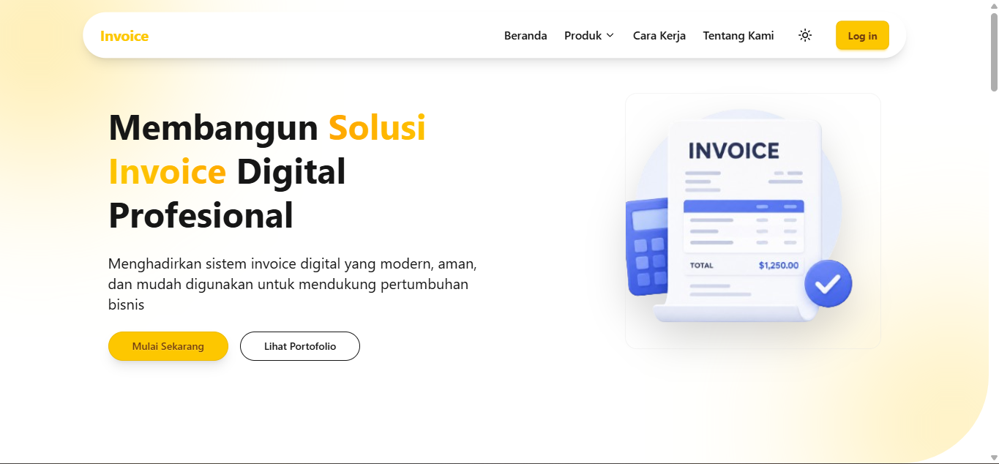
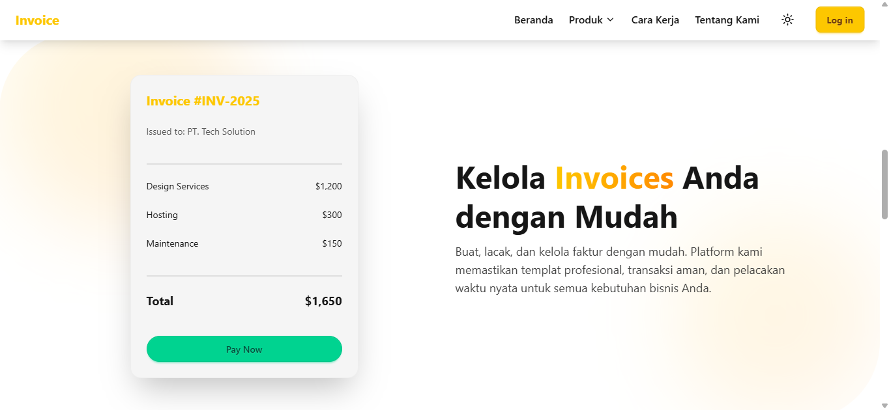
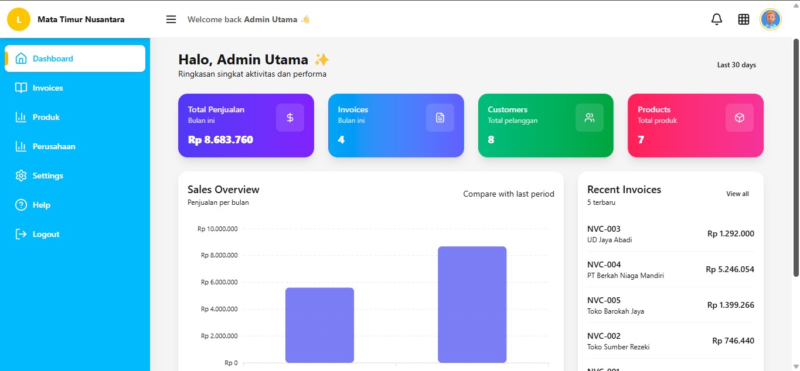
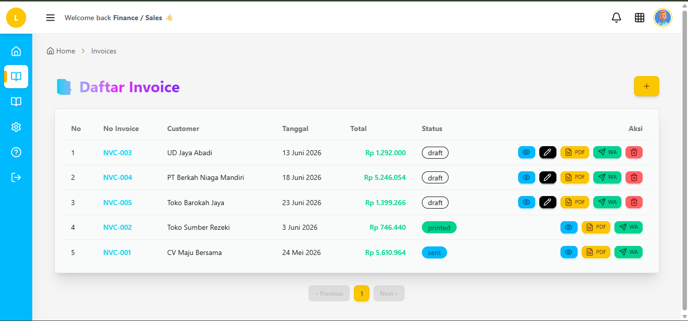
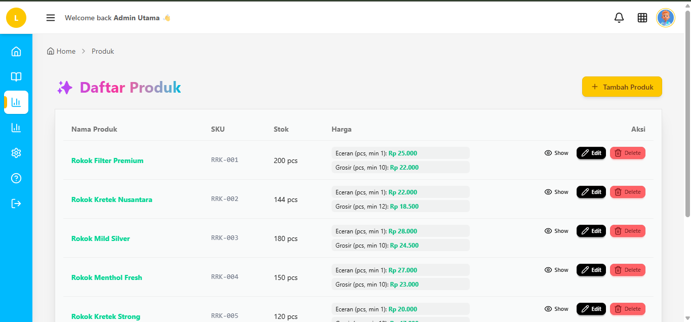
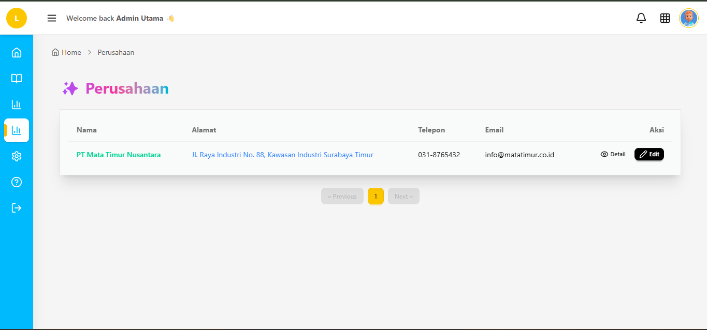
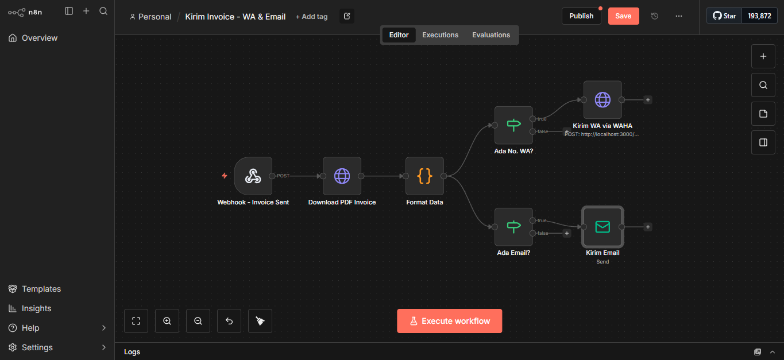
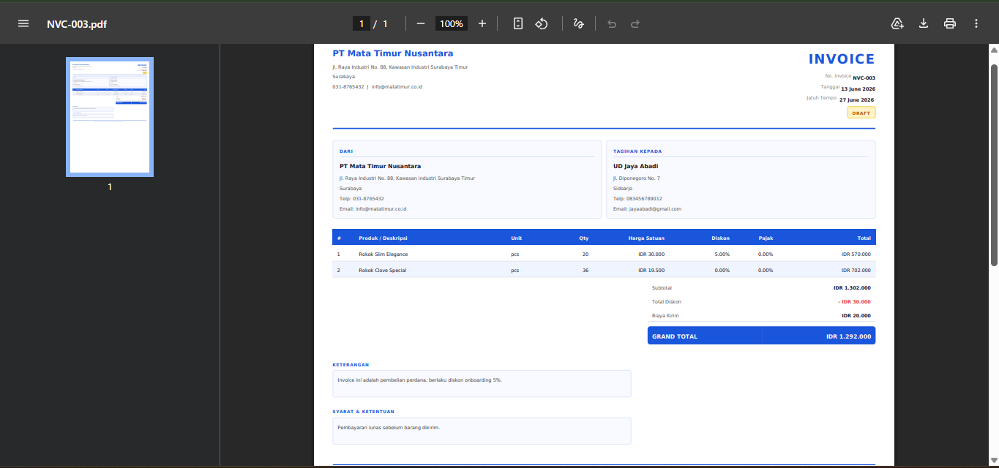

# Invoice Management System

A web application for creating, managing, and delivering PDF invoices to customers. Built with Laravel 12, React, and Inertia.js. Invoices are generated as PDFs via DomPDF and can be forwarded automatically to customers via WhatsApp or Email through an n8n automation workflow.

---

## Screenshots

### Landing Page (Top)



Public hero section with navigation bar, product headline, and call-to-action buttons. No login required to view this page.

---

### Landing Page (Bottom)



Lower section of the landing page: feature highlights, product links, FAQ, sitemap, and footer.

---

### Dashboard



Post-login home screen. Shows invoice statistics, recent activity, and quick navigation. Content adapts based on the logged-in user role.

---

### Invoice List



Paginated table of invoices with status badges (draft, printed, sent, paid, cancelled). Finance sees only their own invoices. Admin sees all invoices from every Finance user. Action buttons per row allow viewing, editing (draft only), marking printed, marking sent, or deleting.

---

### Product List



Admin-only page listing all products with SKU, name, price tiers (eceran/karton), pieces per carton, and current stock. Products can be created, edited, and deleted from this page.

---

### Sender Company



Admin-only page showing the company profile used as the invoice sender. Includes name, address, logo, phone, and email. This data is printed on every generated PDF.

---

### n8n Workflow



The imported workflow inside n8n's canvas. Nodes left to right: Webhook receives the trigger from Laravel, Download PDF fetches the file, Format Data prepares the payload, then two parallel branches check for a WhatsApp number and an email address and deliver accordingly via WAHA and SMTP.

---

### Generated PDF Invoice



The finished PDF opened in a browser from the `pdf_url` returned by the API. Contains company logo, invoice number, dates, bill-to details, line items with per-item discount and tax, subtotal, shipping, extra discount, and grand total. Finance user signature is embedded at the bottom.

---


## Roles

The system has two roles with separate permission sets.

**Admin**

- Manages companies (sender profiles) and products.
- Views all invoices created by any Finance user.
- Cannot create, edit, delete, or change the status of invoices.

**Finance**

- Creates and manages customers.
- Creates, edits, and deletes invoices while status is `draft`.
- Marks invoices as `printed`: generates the PDF and decrements product stock.
- Marks invoices as `sent`: generates the PDF, decrements stock, and fires the n8n webhook to deliver it to the customer.

**Default seeded accounts (after `db:seed`):**

| Role | Email | Password |
|------|-------|----------|
| Admin | admin@example.com | password |
| Finance | finance@example.com | password |

---

## Invoice Status Flow

```
draft -> printed -> sent -> paid
                \-> cancelled
```

| Status | Editable | PDF | Stock Decremented |
|--------|----------|-----|-------------------|
| draft | Yes | No | No |
| printed | No | Generated | Yes |
| sent | No | Generated | Yes |
| paid | No | Exists | Yes |
| cancelled | No | No | No |

PDF files are stored at `storage/app/public/invoices/<invoice_no>.pdf`. If a file already exists for that invoice number it is reused rather than regenerated.

---

## Tech Stack

| Layer | Technology |
|-------|-----------|
| Backend | PHP 8.2, Laravel 12 |
| Frontend | React 18, Inertia.js, TypeScript |
| Styling | Tailwind CSS, shadcn/ui, Radix UI |
| Charts | Recharts, ApexCharts |
| PDF | barryvdh/laravel-dompdf |
| Database | MySQL |
| Queue | Database queue driver |
| Automation | n8n |
| WhatsApp | WAHA (WhatsApp HTTP API) |
| Containerization | Docker Compose |

---


## Project Structure

```
invoice/
|
|-- app/
|   |-- Http/
|   |   |-- Controllers/
|   |   |   |-- InvoiceController.php       # CRUD, PDF generation, n8n trigger
|   |   |   |-- CompanyController.php       # Admin only
|   |   |   |-- ProductController.php       # Admin only
|   |   |   |-- CustomerController.php      # Finance only
|   |   |   |-- NotificationController.php
|   |   |   `-- AuthDashboardController.php
|   |   `-- Middleware/
|   |       `-- CheckRole.php               # Enforces admin/finance access
|   |-- Models/
|   |   |-- Invoice.php
|   |   |-- InvoiceItem.php
|   |   |-- User.php                        # role: admin | finance
|   |   |-- Company.php
|   |   |-- Product.php
|   |   |-- ProductPrice.php
|   |   |-- Stock.php
|   |   `-- Customer.php
|   `-- Notifications/                      # Laravel notification classes
|
|-- database/
|   |-- migrations/                         # 12 migrations
|   `-- seeders/                            # Admin + Finance users, company, products, customers
|
|-- resources/
|   |-- js/
|   |   |-- pages/
|   |   |   |-- Invoices/                   # List, Create, Edit, Show, Print
|   |   |   |-- Products/
|   |   |   |-- Customers/
|   |   |   |-- Company/
|   |   |   |-- Notifications/
|   |   |   |-- landingpage/                # Public pages
|   |   |   `-- auth/
|   |   `-- components/                     # Shared React components
|   `-- views/
|       `-- pdf/
|           `-- invoice.blade.php           # DomPDF Blade template
|
|-- routes/
|   |-- web.php                             # Landing + dashboard
|   |-- invoice.php                         # All app routes
|   |-- auth.php                            # Login, register, logout
|   `-- settings.php
|
|-- docker-compose.yml                      # n8n + WAHA
|-- n8n-send-invoice-workflow.json          # Import this into n8n
```

## Prerequisites

| Requirement | Version |
|-------------|---------|
| PHP | >= 8.2 |
| PHP extensions | mbstring, xml, curl, gd, zip |
| Composer | >= 2.x |
| Node.js | >= 18 |
| npm | >= 9 |
| MySQL | >= 8.0 |
| Docker | >= 24 (for n8n + WAHA) |
| Docker Compose | >= 2.x |

---

## Installation

### 1. Clone the Repository

```bash
git clone <your-repo-url>
cd invoice
```

### 2. Install PHP Dependencies

```bash
composer install
```

### 3. Install Node Dependencies

```bash
npm install
```

### 4. Create Environment File

```bash
cp env.example .env
php artisan key:generate
```

### 5. Configure `.env`

Open `.env` and fill in these values:

```dotenv
APP_NAME="Invoice Management"
APP_ENV=local
APP_DEBUG=true
APP_URL=http://localhost:8000

DB_CONNECTION=mysql
DB_HOST=127.0.0.1
DB_PORT=3306
DB_DATABASE=laravel
DB_USERNAME=root
DB_PASSWORD=

# URL of the n8n webhook that receives the "invoice sent" trigger
N8N_INVOICE_WEBHOOK_URL=http://localhost:5678/webhook/send-invoice

# How n8n sees your Laravel app (from inside Docker)
# n8n via Docker Compose: use http://host.docker.internal:8000
# n8n running natively:   use http://localhost:8000
N8N_LARAVEL_BASE_URL=http://host.docker.internal:8000

QUEUE_CONNECTION=database
SESSION_DRIVER=database
CACHE_STORE=database
```

### 6. Create the Database

```bash
mysql -u root -p -e "CREATE DATABASE laravel CHARACTER SET utf8mb4 COLLATE utf8mb4_unicode_ci;"
```

### 7. Run Migrations

```bash
php artisan migrate
```

### 8. Seed Demo Data (Optional)

Creates two user accounts (Admin + Finance), a sample company, products, customers, and invoices.

```bash
php artisan db:seed
```

### 9. Create Storage Symlink

Required for serving uploaded logos, signatures, and generated PDFs.

```bash
php artisan storage:link
```

### 10. Build Frontend Assets

```bash
# Production build
npm run build

# Development with hot reload
npm run dev
```

### 11. Start the Application

```bash
php artisan serve
```

Open `http://localhost:8000` in a browser.

### 12. Start the Queue Worker

The queue handles in-app and email notifications. Run this in a separate terminal.

```bash
php artisan queue:work
```

---

## Docker Setup (n8n + WAHA)

The `docker-compose.yml` runs n8n and WAHA as containers. Laravel runs on the host directly.

### Start Containers

```bash
docker compose up -d
```

### Services

| Service | URL | Purpose |
|---------|-----|---------|
| n8n | http://localhost:5678 | Workflow automation, webhook receiver |
| WAHA | http://localhost:3000 | WhatsApp HTTP API gateway |

### Stop Containers

```bash
docker compose down
```

### View Logs

```bash
docker compose logs -f n8n
docker compose logs -f waha
```

### Volumes

| Volume | Contents |
|--------|---------|
| `n8n_data` | n8n workflows, credentials, execution history |
| `waha_sessions` | WhatsApp session data |

Volumes persist across container restarts. To reset completely:

```bash
docker compose down -v
```

### WAHA: Connect WhatsApp

1. Open `http://localhost:3000`.
2. Click **Start Session**.
3. Scan the QR code with WhatsApp on your phone.
4. Session status turns green when connected.

---

## n8n Workflow

### Import the Workflow

1. Open n8n at `http://localhost:5678`.
2. Go to **Workflows** in the left sidebar.
3. Click the **+** button and choose **Import from File**.
4. Select `n8n-send-invoice-workflow.json` from the project root.
5. Click **Activate** (toggle top right) to enable the webhook.

### Workflow Nodes

| Node | Type | Purpose |
|------|------|---------|
| Webhook - Invoice Sent | Webhook | Receives POST from Laravel when invoice is marked sent |
| Download PDF Invoice | HTTP Request | Fetches the PDF file from the `pdf_url` in the payload |
| Format Data | Code | Extracts customer name, phone, email, and file for delivery |
| Ada No. WA? | If | Checks if customer has a WhatsApp number |
| Kirim WA via WAHA | HTTP Request | Sends PDF as WhatsApp message via WAHA |
| Ada Email? | If | Checks if customer has an email address |
| Kirim Email | Email | Sends PDF as email attachment |

### Payload Sent by Laravel

When Finance marks an invoice as sent, Laravel posts this to n8n:

```json
{
  "invoice_no": "INV-2025-001",
  "customer_name": "Budi Santoso",
  "customer_phone": "+6281234567890",
  "customer_email": "budi@example.com",
  "pdf_url": "http://host.docker.internal:8000/storage/invoices/INV-2025-001.pdf",
  "total": 1650000
}
```

Note: `pdf_url` uses `host.docker.internal` so n8n inside Docker can reach the Laravel app on the host.

### n8n Credentials to Configure

After importing the workflow, configure these credentials in n8n under **Credentials**:

- **WAHA HTTP Auth**: base URL `http://waha:3000`, API key if set.
- **Email (SMTP)**: your SMTP server, username, and password.

---


### Key Endpoint Responses

**PATCH `/invoices/{id}/printed`** - generates PDF:

```json
{
  "success": true,
  "pdf_url": "http://localhost:8000/storage/invoices/INV-2025-001.pdf"
}
```

**PATCH `/invoices/{id}/sent`** - generates PDF and triggers n8n:

```json
{
  "success": true,
  "message": "Invoice ditandai sent & dikirim ke n8n"
}
```

If n8n is not running (non-blocking, invoice still updates):

```json
{
  "success": true,
  "message": "Invoice ditandai sent, tapi gagal menghubungi n8n (cek apakah n8n sudah jalan)"
}
```

---

## Deployment to Google Cloud

### Option A: Google Cloud Run (Recommended)

Cloud Run runs the app as a stateless container. Best for low-to-medium traffic.

#### 1. Install Google Cloud CLI

```bash
# macOS
brew install google-cloud-sdk

# Linux
curl https://sdk.cloud.google.com | bash
exec -l $SHELL
```

#### 2. Authenticate and Set Project

```bash
gcloud auth login
gcloud config set project YOUR_PROJECT_ID
gcloud services enable run.googleapis.com cloudbuild.googleapis.com sqladmin.googleapis.com
```

#### 3. Create Cloud SQL (MySQL)

```bash
gcloud sql instances create invoice-db \
  --database-version=MYSQL_8_0 \
  --tier=db-f1-micro \
  --region=asia-southeast2

gcloud sql databases create laravel --instance=invoice-db

gcloud sql users set-password root \
  --instance=invoice-db \
  --password=YOUR_DB_PASSWORD
```

#### 4. Create a Dockerfile

Create `Dockerfile` in the project root:

```dockerfile
FROM php:8.2-fpm-alpine

RUN apk add --no-cache nginx nodejs npm \
    && docker-php-ext-install pdo_mysql mbstring gd zip

WORKDIR /var/www/html

COPY . .

RUN composer install --optimize-autoloader --no-dev \
    && npm install && npm run build \
    && php artisan config:cache \
    && php artisan route:cache \
    && php artisan view:cache

COPY docker/nginx.conf /etc/nginx/nginx.conf
COPY docker/start.sh /start.sh
RUN chmod +x /start.sh

EXPOSE 8080

CMD ["/start.sh"]
```

#### 5. Build and Push to Artifact Registry

```bash
gcloud artifacts repositories create invoice-repo \
  --repository-format=docker \
  --location=asia-southeast2

gcloud builds submit --tag asia-southeast2-docker.pkg.dev/YOUR_PROJECT_ID/invoice-repo/invoice:latest
```

#### 6. Deploy to Cloud Run

```bash
gcloud run deploy invoice-app \
  --image asia-southeast2-docker.pkg.dev/YOUR_PROJECT_ID/invoice-repo/invoice:latest \
  --platform managed \
  --region asia-southeast2 \
  --allow-unauthenticated \
  --set-env-vars "APP_ENV=production,APP_DEBUG=false,APP_URL=https://YOUR_CLOUD_RUN_URL" \
  --set-env-vars "DB_CONNECTION=mysql,DB_HOST=/cloudsql/YOUR_PROJECT_ID:asia-southeast2:invoice-db" \
  --set-env-vars "DB_DATABASE=laravel,DB_USERNAME=root,DB_PASSWORD=YOUR_DB_PASSWORD" \
  --add-cloudsql-instances YOUR_PROJECT_ID:asia-southeast2:invoice-db
```

#### 7. Run Migrations on Cloud Run

```bash
gcloud run jobs create invoice-migrate \
  --image asia-southeast2-docker.pkg.dev/YOUR_PROJECT_ID/invoice-repo/invoice:latest \
  --command "php" \
  --args "artisan,migrate,--force" \
  --region asia-southeast2

gcloud run jobs execute invoice-migrate
```

---

### Option B: Google Compute Engine (VM)

Better for persistent storage (uploaded files, PDFs) and running the queue worker.

#### 1. Create a VM

```bash
gcloud compute instances create invoice-vm \
  --zone=asia-southeast2-a \
  --machine-type=e2-medium \
  --image-family=ubuntu-2204-lts \
  --image-project=ubuntu-os-cloud \
  --tags=http-server,https-server
```

#### 2. Open Firewall Ports

```bash
gcloud compute firewall-rules create allow-http \
  --allow tcp:80,tcp:443 \
  --target-tags http-server,https-server
```

#### 3. SSH into the VM

```bash
gcloud compute ssh invoice-vm --zone=asia-southeast2-a
```

#### 4. Install Dependencies on the VM

```bash
sudo apt update && sudo apt upgrade -y

# PHP 8.2
sudo add-apt-repository ppa:ondrej/php -y
sudo apt install -y php8.2 php8.2-fpm php8.2-mysql php8.2-mbstring \
  php8.2-xml php8.2-curl php8.2-gd php8.2-zip

# Composer
curl -sS https://getcomposer.org/installer | php
sudo mv composer.phar /usr/local/bin/composer

# Node.js 20
curl -fsSL https://deb.nodesource.com/setup_20.x | sudo -E bash -
sudo apt install -y nodejs

# MySQL
sudo apt install -y mysql-server
sudo mysql_secure_installation

# Nginx
sudo apt install -y nginx

# Docker (for n8n + WAHA)
curl -fsSL https://get.docker.com | sh
sudo usermod -aG docker $USER
```

#### 5. Clone and Configure the App

```bash
cd /var/www
sudo git clone <your-repo-url> invoice
sudo chown -R $USER:www-data invoice
cd invoice

composer install --optimize-autoloader --no-dev
npm install && npm run build

cp env.example .env
# Edit .env with production values
nano .env

php artisan key:generate
php artisan migrate --force
php artisan db:seed --force
php artisan storage:link
php artisan config:cache
php artisan route:cache
php artisan view:cache
```

#### 6. Configure Nginx

```bash
sudo nano /etc/nginx/sites-available/invoice
```

```nginx
server {
    listen 80;
    server_name yourdomain.com;
    root /var/www/invoice/public;
    index index.php;

    client_max_body_size 20M;

    location / {
        try_files $uri $uri/ /index.php?$query_string;
    }

    location ~ \.php$ {
        fastcgi_pass unix:/run/php/php8.2-fpm.sock;
        fastcgi_param SCRIPT_FILENAME $document_root$fastcgi_script_name;
        include fastcgi_params;
    }

    location ~ /\.ht {
        deny all;
    }
}
```

```bash
sudo ln -s /etc/nginx/sites-available/invoice /etc/nginx/sites-enabled/
sudo nginx -t
sudo systemctl restart nginx
```

#### 7. Set Folder Permissions

```bash
sudo chown -R www-data:www-data /var/www/invoice/storage
sudo chown -R www-data:www-data /var/www/invoice/bootstrap/cache
sudo chmod -R 775 /var/www/invoice/storage
```

#### 8. Configure Queue Worker with Supervisor

```bash
sudo apt install -y supervisor

sudo nano /etc/supervisor/conf.d/invoice-worker.conf
```

```ini
[program:invoice-worker]
process_name=%(program_name)s_%(process_num)02d
command=php /var/www/invoice/artisan queue:work --sleep=3 --tries=3 --timeout=90
autostart=true
autorestart=true
user=www-data
numprocs=1
redirect_stderr=true
stdout_logfile=/var/www/invoice/storage/logs/worker.log
```

```bash
sudo supervisorctl reread
sudo supervisorctl update
sudo supervisorctl start invoice-worker:*
```

#### 9. SSL with Certbot (Optional)

```bash
sudo apt install -y certbot python3-certbot-nginx
sudo certbot --nginx -d yourdomain.com
```

---

## Key API Routes

| Method | URI | Role | Description |
|--------|-----|------|-------------|
| GET | `/invoices` | Admin, Finance | List invoices |
| POST | `/invoices` | Finance | Create invoice |
| GET | `/invoices/{id}` | Admin, Finance | Invoice detail |
| PATCH | `/invoices/{id}` | Finance | Update invoice (draft only) |
| DELETE | `/invoices/{id}` | Finance | Delete invoice (draft only) |
| PATCH | `/invoices/{id}/printed` | Finance | Mark printed, generate PDF |
| PATCH | `/invoices/{id}/sent` | Finance | Mark sent, generate PDF, trigger n8n |
| GET | `/invoices/{id}/print` | Admin, Finance | Print preview |
| GET | `/companies` | Admin | List companies |
| POST | `/companies` | Admin | Create company |
| PATCH | `/companies/{id}` | Admin | Update company |
| DELETE | `/companies/{id}` | Admin | Delete company |
| GET | `/products` | Admin | List products |
| POST | `/products` | Admin | Create product |
| PATCH | `/products/{id}` | Admin | Update product |
| DELETE | `/products/{id}` | Admin | Delete product |
| GET | `/customers` | Finance | List customers |
| POST | `/customers` | Finance | Create customer |
| PATCH | `/customers/{id}` | Finance | Update customer |
| DELETE | `/customers/{id}` | Finance | Delete customer |
| GET | `/notifications` | Admin, Finance | List notifications |
| POST | `/notifications/read-all` | Admin, Finance | Mark all as read |

---
